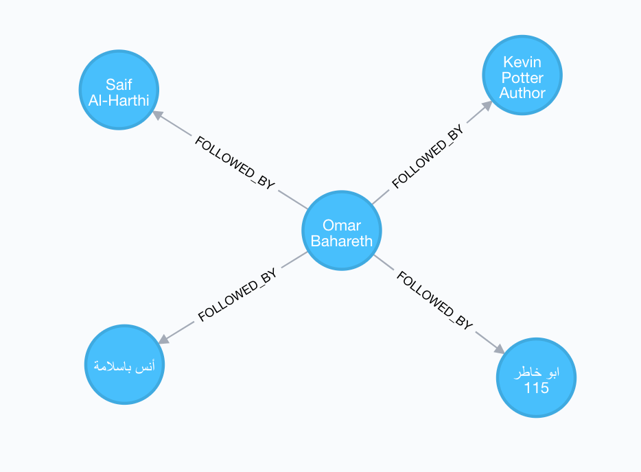

# TwitterGrapher
This is just a basic [Phoenix](phoenixframework.org/) app configured with [Neo4j](https://neo4j.com/) and [Bolt.Sips](https://github.com/florinpatrascu/bolt_sips). 

## Requirements
* Elixir 1.4
* Phoenix 1.2.4
* Neo4j 3.2.0
* Bolt sips 0.3

## Usage
After running the Phoenix server, visit: localhost:4000/store-twitter-relations and enter your screen name. If you have a lot of followers you might need to wait a while. There's no graphing yet, you can view the graph in the Neo4j browser:

## Issues
* Twitter API rate limits are quite hindering, it takes a long time to gather the data, perhaps web scraping could be used instead.

## TODO
* [ ] Use something like Popoto.js or Sigma.js to visualize the followers
